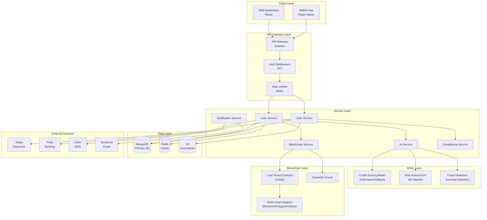
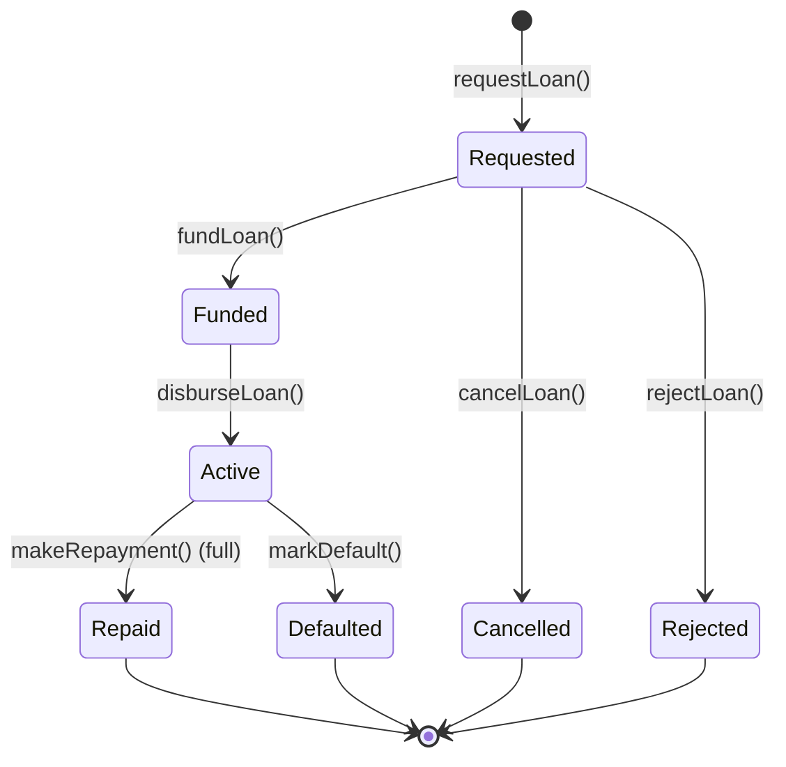
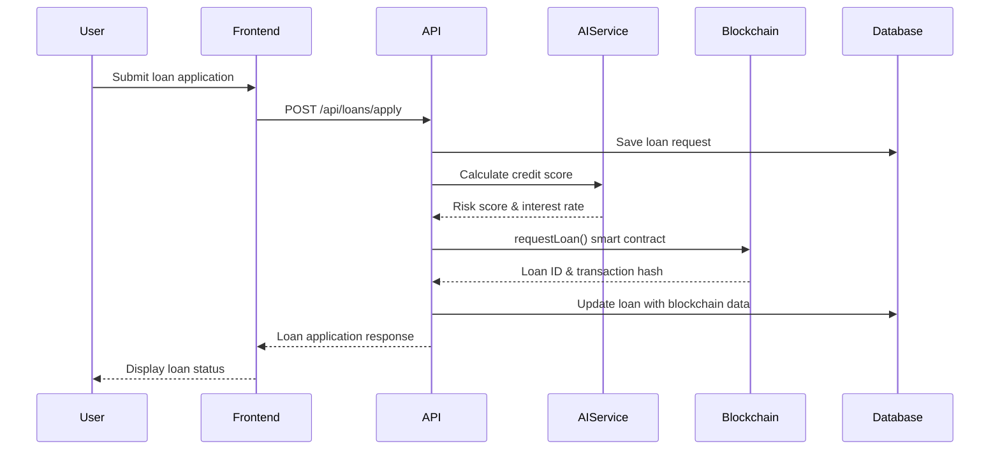
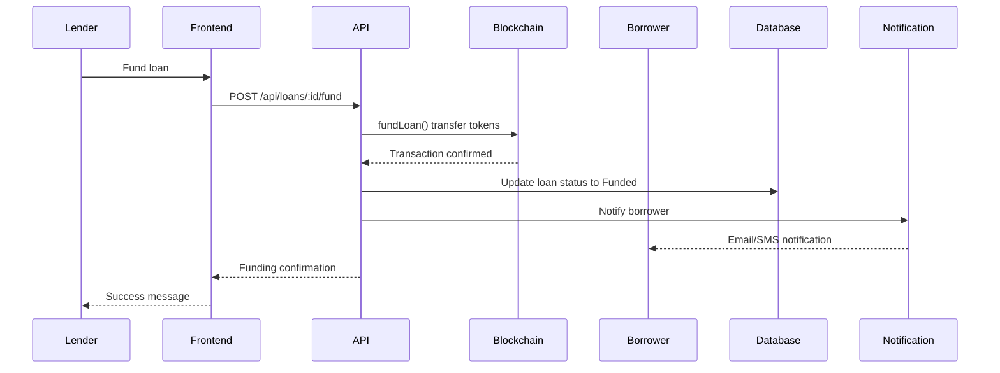

# Architecture Overview

**LendSmart System Architecture**

High-level architecture and component design of the LendSmart platform.

---

## Table of Contents

- [System Overview](#system-overview)
- [Architecture Diagram](#architecture-diagram)
- [Component Architecture](#component-architecture)
- [Data Flow](#data-flow)
- [Technology Stack](#technology-stack)
- [Deployment Architecture](#deployment-architecture)

---

## System Overview

LendSmart is a microservices-based decentralized lending platform that combines:

- **Backend Services:** Node.js/Express REST API
- **Smart Contracts:** Solidity contracts on EVM-compatible blockchains
- **AI/ML Services:** Python-based credit scoring and risk assessment
- **Frontend Applications:** React web app and React Native mobile apps
- **Data Layer:** MongoDB (primary), Redis (cache), Blockchain (immutable ledger)

### Core Principles

1. **Microservices:** Loosely coupled, independently deployable services
2. **Blockchain-First:** Critical operations on smart contracts
3. **AI-Powered:** Machine learning for credit decisions
4. **Security-First:** Multi-layer security and compliance
5. **Scalable:** Horizontal scaling with containerization

---

## Architecture Diagram



---

## Component Architecture

### 1. Backend API (code/backend/)

**Purpose:** Central REST API server handling business logic.

**Technology:** Node.js 18+, Express 4.x

**Key Components:**

```
backend/
├── src/
│   ├── server.js                    # Entry point, Express setup
│   ├── routes/                      # API route definitions
│   │   ├── authRoutes.js            # Authentication endpoints
│   │   ├── loanRoutes.js            # Loan management endpoints
│   │   ├── userRoutes.js            # User management endpoints
│   │   └── adminRoutes.js           # Admin endpoints
│   ├── controllers/                 # Business logic controllers
│   │   ├── authController.js        # Auth operations
│   │   ├── loanController.js        # Loan CRUD operations
│   │   ├── userController.js        # User operations
│   │   └── adminController.js       # Admin operations
│   ├── models/                      # MongoDB schemas
│   │   ├── User.js                  # User model
│   │   └── Loan.js                  # Loan model
│   ├── services/                    # Business services
│   │   ├── ai/aiService.js          # AI integration
│   │   ├── blockchain/              # Blockchain interactions
│   │   ├── notification/            # Email/SMS services
│   │   └── compliance/              # Compliance services
│   ├── middleware/                  # Express middleware
│   │   ├── auth.js                  # JWT authentication
│   │   ├── rateLimiter.js          # Rate limiting
│   │   ├── errorHandler.js          # Error handling
│   │   └── validation/              # Input validation
│   ├── config/                      # Configuration files
│   │   ├── database.js              # MongoDB connection
│   │   ├── redis.js                 # Redis connection
│   │   └── blockchain.js            # Web3 configuration
│   └── utils/                       # Utility functions
│       ├── logger.js                # Winston logger
│       └── encryption.js            # Encryption utilities
```

**File-to-Module Mapping:**

| File                   | Module           | Responsibility                         |
| ---------------------- | ---------------- | -------------------------------------- |
| `server.js`            | Main Application | Express setup, middleware, routes      |
| `authController.js`    | Authentication   | User registration, login, JWT issuance |
| `loanController.js`    | Loan Management  | Loan CRUD, funding, repayment          |
| `aiService.js`         | AI Integration   | Credit scoring, risk assessment        |
| `blockchainService.js` | Blockchain       | Smart contract interactions            |
| `complianceService.js` | Compliance       | KYC/AML, GDPR, audit logging           |

---

### 2. Smart Contracts (code/smart-contracts/)

**Purpose:** On-chain loan lifecycle management.

**Technology:** Solidity 0.8.20, Hardhat, OpenZeppelin

**Key Contracts:**

```solidity
// Main loan contract
contract LendSmartLoan is Ownable, ReentrancyGuard, Pausable {
    // Loan lifecycle management
    function requestLoan(...) external returns (uint256 loanId);
    function fundLoan(uint256 loanId) external;
    function disburseLoan(uint256 loanId) external;
    function makeRepayment(uint256 loanId, uint256 amount) external;
    function markDefault(uint256 loanId) external;

    // Collateral management
    function depositCollateral(uint256 loanId) external;
    function releaseCollateral(uint256 loanId) external;

    // Risk assessment integration
    function assignRiskScore(uint256 loanId, uint256 score) external;
}
```

**State Transitions:**



---

### 3. AI/ML Services (code/credit_risk_models/)

**Purpose:** Credit scoring and risk assessment using machine learning.

**Technology:** Python 3.8+, Scikit-learn, XGBoost, FastAPI

**Key Components:**

```
credit_risk_models/
├── src/
│   ├── credit_scoring_model.py      # Main ML model class
│   ├── risk_assessment.py           # Risk calculation
│   ├── scoring.py                   # Credit score computation
│   ├── data_sources.py              # Data integration
│   └── utils.py                     # Utility functions
├── models/                          # Trained model artifacts
├── train_model.py                   # Model training script
└── prediction_service.py            # FastAPI prediction service
```

**Model Pipeline:**

```python
class CreditScoringModel:
    def __init__(self, config):
        self.model_type = config.get("model_type", "ensemble")
        self.preprocessor = self._build_preprocessor()

    def _build_preprocessor(self):
        # Numeric features: scaling, imputation
        # Categorical features: one-hot encoding
        return ColumnTransformer([...])

    def train(self, X, y):
        # Train ensemble of models:
        # - Random Forest
        # - Gradient Boosting
        # - XGBoost
        # - LightGBM

    def predict(self, X):
        # Return credit score, risk level, interest rate
```

---

### 4. Frontend Applications

#### Web Frontend (code/web-frontend/)

**Technology:** React 18+, Redux Toolkit, Tailwind CSS

**Architecture:** Feature-based structure

```
web-frontend/src/
├── pages/                   # Route pages
│   ├── HomePage.js
│   ├── LoginPage.js
│   ├── DashboardPage.js
│   ├── LoanApplicationPage.js
│   └── LoanMarketplacePage.js
├── components/              # Reusable components
│   ├── layout/
│   └── routing/
├── contexts/                # React Context providers
│   ├── AuthContext.js
│   ├── BlockchainContext.js
│   └── ApiContext.js
├── services/                # API clients
│   ├── apiService.js
│   └── blockchainService.js
└── utils/                   # Utilities
```

#### Mobile Frontend (code/mobile-frontend/)

**Technology:** React Native 0.79+, React Navigation

**Architecture:** Feature-based with screen/component separation

---

## Data Flow

### Loan Application Flow



### Loan Funding Flow



---

## Technology Stack

### Backend Stack

| Layer          | Technology | Version | Purpose            |
| -------------- | ---------- | ------- | ------------------ |
| Runtime        | Node.js    | 18+     | JavaScript runtime |
| Framework      | Express    | 4.18+   | Web framework      |
| Database       | MongoDB    | 5.0+    | Primary database   |
| Cache          | Redis      | 6.0+    | Caching & sessions |
| Authentication | JWT        | -       | Token-based auth   |
| Validation     | Joi        | 17+     | Input validation   |
| Logging        | Winston    | 3+      | Structured logging |

### Blockchain Stack

| Layer        | Technology     | Version | Purpose                 |
| ------------ | -------------- | ------- | ----------------------- |
| Language     | Solidity       | 0.8.20  | Smart contracts         |
| Framework    | Hardhat        | 2.x     | Development environment |
| Library      | OpenZeppelin   | 5.x     | Security & standards    |
| Provider     | Infura/Alchemy | -       | Blockchain nodes        |
| Web3 Library | ethers.js      | 6.x     | Blockchain interaction  |

### AI/ML Stack

| Layer          | Technology       | Version | Purpose              |
| -------------- | ---------------- | ------- | -------------------- |
| Language       | Python           | 3.8+    | ML development       |
| ML Library     | Scikit-learn     | 1.3+    | Traditional ML       |
| Boosting       | XGBoost/LightGBM | Latest  | Gradient boosting    |
| API Framework  | FastAPI          | 0.100+  | Prediction service   |
| Explainability | SHAP             | Latest  | Model interpretation |

### Frontend Stack

| Layer     | Technology    | Version | Purpose            |
| --------- | ------------- | ------- | ------------------ |
| Framework | React         | 18+     | UI library         |
| Mobile    | React Native  | 0.79+   | Mobile apps        |
| State     | Redux Toolkit | Latest  | State management   |
| Styling   | Tailwind CSS  | 3+      | CSS framework      |
| Web3      | ethers.js     | 6.x     | Wallet integration |

---

## Deployment Architecture

### Development Environment

```
Developer Machine
├── Backend (localhost:3001)
├── Frontend (localhost:3000)
├── MongoDB (localhost:27017)
├── Redis (localhost:6379)
├── ML Service (localhost:8000)
└── Hardhat Node (localhost:8545)
```

### Production Environment (Kubernetes)

```
Production Cluster
├── Ingress (Load Balancer)
├── Backend Pods (3 replicas)
│   ├── API Server
│   ├── Background Workers
│   └── Cron Jobs
├── Frontend Pods (2 replicas)
│   └── Nginx Static Server
├── ML Service Pods (2 replicas)
│   └── FastAPI Service
├── MongoDB StatefulSet (3 replicas)
│   └── ReplicaSet
├── Redis StatefulSet (3 replicas)
│   └── Cluster Mode
└── Monitoring Stack
    ├── Prometheus
    ├── Grafana
    └── Alert Manager
```

### Multi-Chain Deployment

```
Blockchain Networks
├── Ethereum Mainnet
│   └── Loan Contract: 0x...
├── Polygon Mainnet
│   └── Loan Contract: 0x...
└── Arbitrum One
    └── Loan Contract: 0x...
```

---

## Security Architecture

### Defense in Depth

```
Security Layers
├── Network Layer
│   ├── Firewall Rules
│   ├── DDoS Protection
│   └── VPN Access
├── Application Layer
│   ├── Rate Limiting
│   ├── CORS Protection
│   ├── Input Validation
│   └── Authentication/Authorization
├── Data Layer
│   ├── Encryption at Rest
│   ├── Encryption in Transit (TLS)
│   └── Field-Level Encryption
├── Smart Contract Layer
│   ├── Reentrancy Guards
│   ├── Access Control
│   └── Pausable Functionality
└── Monitoring Layer
    ├── Intrusion Detection
    ├── Audit Logging
    └── Alert System
```

---

## Performance Optimization

### Caching Strategy

```
Cache Hierarchy
├── Browser Cache (Static assets)
├── CDN Cache (Frontend assets)
├── Redis Cache (API responses)
│   ├── User sessions
│   ├── Loan marketplace listings
│   └── Credit scores (5 min TTL)
└── Database Query Cache
```

### Database Optimization

- **Indexes:** All query fields indexed
- **Connection Pooling:** Min 10, Max 50 connections
- **Read Replicas:** Separate read/write operations
- **Aggregation Pipeline:** Optimized queries

---

## Scalability

### Horizontal Scaling

- **Stateless API:** Scale backend pods independently
- **Message Queue:** Bull for async job processing
- **Load Balancing:** Round-robin across pods
- **Database Sharding:** User-based sharding strategy

### Vertical Scaling

- **Database:** Increase resources as data grows
- **ML Service:** GPU instances for training
- **Redis:** Increase memory for cache

---

**For implementation details:** See individual component documentation and [Contributing Guide](CONTRIBUTING.md).
